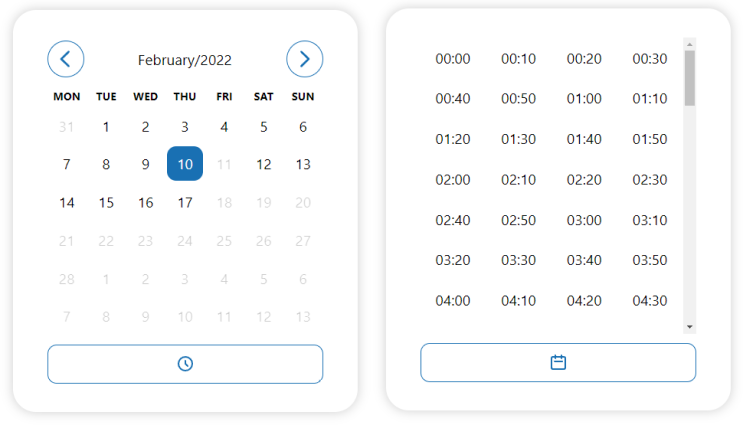

# react-datetime-pickers

> React ready picker components for dates and time (month picker, week picker, day picker, range picker)

[](https://www.npmjs.com/package/react-datetime-pickers)
[](https://www.npmjs.com/package/react-datetime-pickers)




## Install

```bash
npm install --save react-datetime-pickers
```
or
```bash
yarn install react-datetime-pickers
```

## Usage

```jsx
import React, {useState} from 'react';

import { DateTimePicker } from 'react-datetime-pickers';
import 'react-datetime-pickers/dist/index.css';

export default function Example() {
    const [date, setDate] = useState(new Date());
    
    return (
        <DateTimePicker
            selected={date}
            onChange={setDate}
        />
    );
}
```

## License

MIT © [mauriziocarella](https://github.com/mauriziocarella)
